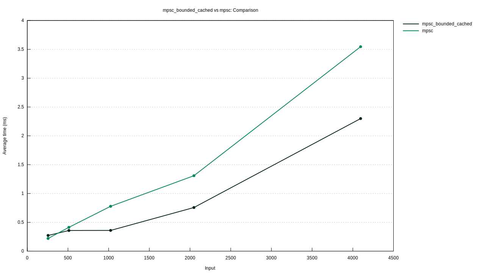
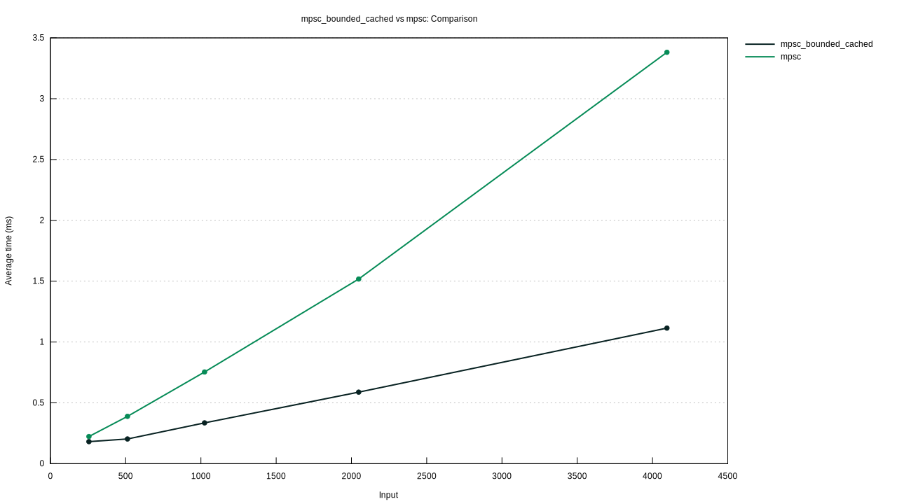

# Bounded MPSC with Cache in Producer

The basic idea is that the producer has a cache and will first apply for an unused slice from the ring buffer. When the number of data in the local cache reaches the size of the slice, the data will be written into the slice applied from the ring buffer. When the first slice has not been successfully written, subsequent slices cannot be read. In this way, the frequency of lock usage can be reduced to improve performance.

The benchmark as shown below:

* When the slice size per application is 16:

  

* When the slice size per application is 32:

  