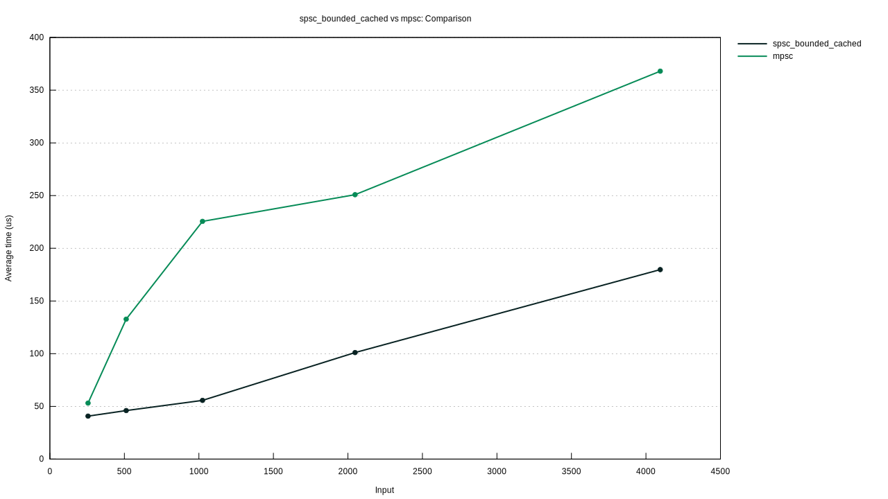

# Bounded SPSC with Cached Info

Producers and consumers cache the head and tail indexes of the ring buffer and its occupancy. Tried this to reduce the pressure on atomics of the ring buffer, but it doesn't seem to work.

The benchmark as shown below:

